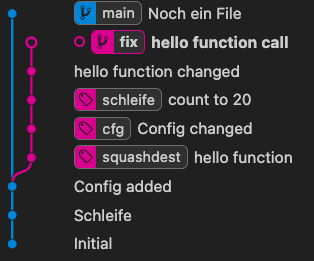
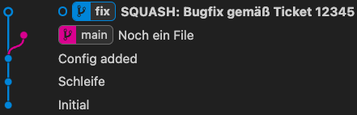
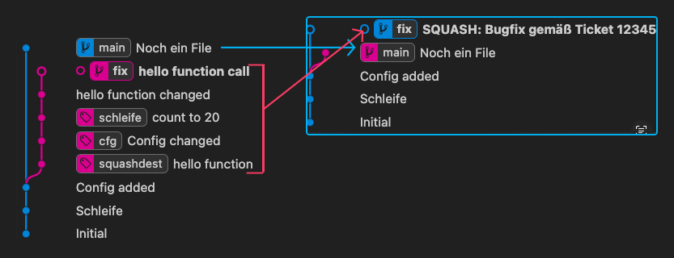
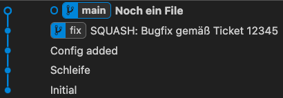
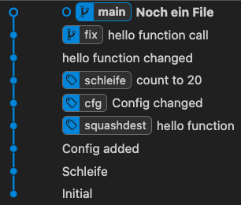
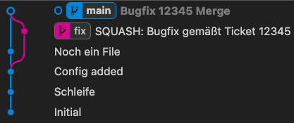
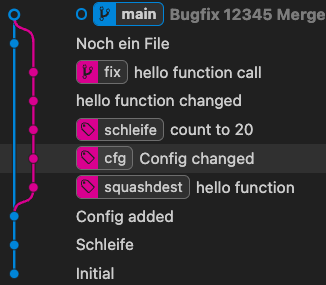

# Merge, Rebase, Cherry-Pick, Squash

In diesem Repo wird ein kleines Projekt simuliert.

Zurücksetzen mit ./reset.ps1 (PowerShell) oder neu klonen des Repos.

Es gibt 3 Branches

1. `main` : In diesem gibt es nur eine kleine Codebasis und eine config.txt mit Inhalt "1"
2. `fix` : In diesem wurde weiter entwickelt und die config.txt auf "2" geändert.
3. `feature` : In diesem wurde ebenfalls die Schleifenlänge erhöht. Werden `fix` und `feature` gemerged, kommt es zu einem Konflikt.

## Konflikte 

In allen Fällen kann es zu Konflikten kommen. Wie diese behandelt werden wird je Verfahren (Merge, Rebase, Cherry-Pick) beschrieben.

Grundsätzlich kann man das Verfahren abbrechen mit dem `--abort` Parameter der an den Git Befehl angehängt wird.

Also `git merge --abort`, `git rebase --abort` oder `git cherry-pick --abort`

Damit kann man den Vorgang erstmal abbrechen um später das Problem (vielleicht zusammen mit einem Kollegen) zu lösen.

## Merge

Um den kompletten `fix` Branch in den `main` Branch zu mergen muss

1. In den `main` Branch gewechselt werden, dies ist bereits geschehen kann aber mit `git checkout main` durchgeführt werden.
2. `git merge fix` merged den `fix` Branch in den aktuellen (`main`) Branch

Gute Praxis ist dies jedoch nicht da

1. nun im `main` Branch Konflikte entstehen könnten
2. der `main` Branch unnötig lang in "Bearbeitung" ist. Während dessen könnte dieser sich auf github erneut ändern was zu erneuten Merge-Konflikten führen könnte. Auch ist der Branch so ggfs. nicht mehr lauffähig
3. Tests müssten auf dem `main` Branch ausgeführt werden. Änderungen (kleinere Bugfixes) müssten dann entweder auf einen weiteren Fix-Branch oder direkt im `main` Branch durchgeführt werden.

Das ist es sinnvoller: **Merge IN `fix` Branch und dann zurück in den `main`Branch**

1. `git checkout fix` : Wechseln in den `fix` Branch
2. `git merge main` : den `main` Branch in den `fix` Branch mergen. Dann alles Konflikte, Tests... durchführen
3. `git checkout main` : Zurück in den `main` Branch
4. `git merge fix` : Den funktionierenden Branch (frei von Bugs, Merge Konflikts...) in den `main` Branch mergen

Danach kann man den `main` branch pushen oder in den `Q` Branch mergen und pushen.

Man benötigt kaum Zeit im `main` Branch. Eigentlich nur zum Mergen bei dem aber sicher ist, das es keine Konflikte mehr geben kann und die Version auch läuft.

### Merge Konflikt

Dieser kann ausgelöst werden in dem `fix` Branch und `feature` Branch gemerged werden (in den `main` Branch).

Bzw. in der besseren Praxis:

```
git checkout fix
git merge main
git merge feature
```

Dies führt zu 2 Konflikten:

```js
console.log('Programmstart');

<<<<<<< HEAD
for(var i = 0; i < 20; i++) {
    hello(i);
=======
for(var i = 0; i < 30; i++) {
    console.log(i);
>>>>>>> feature
}

function hello(i) {
    console.log(`Number ${i}`);
}


<<<<<<< HEAD

=======
>>>>>>> feature
```

Ein Konflikt geht immer von `<<<<<<<<` bis `>>>>>>>>`.

Darin sind 2 Versionen des Inhalts aufgeführt. Neben den `<<<<<<<<` bzw. `>>>>>>>>` steht immer, von welcher Quelle dieser Inhalt kommt. Geteilt werden die Inhalte mit `========` 

```
<<<<<<<< HEAD
```
Bedeutet, das der folgende Code aus dem aktuellen Commit des aktuellen Branches stammt. In unserem Fall aus dem `fix` Branch. `========` markiert das Ende des Codes von `HEAD`

```
>>>>>>>> feature
```

Bedeutete, das der Code davor (bis zum  `========`) vom `feature` Branch kommt.

Die Konflikte können manuell im Editor behoben werden. Es gibt auch viele Merge-Tools die einem helfen können.

Letztendlich gelten 3 Regeln beim beseitigen des Konfliktes:

1. **Der Code muss danach stimmen**
2. **Die Konflikmarkierungen (`<<<<<<<<` usw.) müssen danach beseitigt sein**
3. **Nach dem der Code nun passt muss ein Commit (add/commit) durchgeführt werden**

Visual Studio Code ist da hilfreich da es die Konflikte gut darstellt und Möglichkeiten bietet damit umzugehen.

Bis auf die Auswahl welcher Codebereich genutzt werden soll, rate ich von irgendwelchen Tools ab. Nach dem der Code passt sollte im Terminal mit git ein commit (add + commit) durchgeführt werden. Ein aussgagekräftige Commit Message aus der ersichtlich ist, das es ein Merge-Konflikt war, ist ratsam.

## Rebase

Bei einem Rebase wird kein Commit erstellt, der die Änderungen beider Branches beinhaltet. Sondern es werden alle Commits neu erstellt und die des anderen Branches eingebunden.

Danach ist es so, als hätte es den zweiten Branch nie gegeben.

> Da die Commit-History gelöscht und neu erstellt wird, kann es zu Abweichungen zur vorherigen Commit-History kommen. Gerade bei einem gepushten Repo auf Github kann ein Rebase dazu führen, das diese Version nicht einfach gepushed werden kann. Hierzu ist dann `git push --force` notwendig. Die löscht auf Github ebenfalls die History und legt sie neu an.

> !!! Commits die Lokal nicht vorhanden sind (noch nicht gepullt) gehen beim `force` Push unweigerlich verloren!

```
git checkout fix
git rebase main
```

Auch hier der gleiche Weg. Es ist aber keine Commit-Message notwendig da die Commits von `main` nun Bestandteil von `fix` sind.

Danach

``` 
git checkout main
git rebase fix
```

Nun ist alles in Ordnung. Der `fix` Branch könnte nun gelöscht werden.

```
git branch -d fix
````

### Konflikte beim Rebase

Auch hier wird es zu einem Konflikt kommen wenn zusätzlich noch der `feature` Branch gerebased wird.

```
git checkout feature
git rebase main
```

Anschließend die Konflikte lösen (siehe oben). Jetzt wird aber kein Commit manuell durchgeführt sondern

```
git rebase --continue
```

ausgeführt. Dieser erstellt, falls nötig einen Commit dessen Message man im konfigurierten Editor eingeben/ändern kann.

### Cherry Picks und Rebase

Gab es bereits einen oder mehrere Cherry Picks, muss bei einem Rebase `--reapply-cherry-picks` angegeben werden, damit diese Cherry-Picks berücksichtigt werden.

## Cherry-Pick

Ein Cherry-Pick ist wie ein Merge. Jedoch wird nur ein ausgewählter Commit einen anderen Branches gemerged.

Dies erlaubt es ein einzellnen Bugfix oder Dateiänderungen (Konfiguration, i18n, ...) zu übernehmen, die restliche Entwicklung aber im zweiten Branch belassen (um diese dort fertigzustellen).

Im Beispiel gibt es ein Commit `Config changed`. Dieses Commit wollen wir nun mit Cherry-Pick in den `main` Branch holen.

Ich habe diesem Commit den Tag `cfg` gegeben damit ich das Beispiel funktionsfähig darstellen kann.

```
git checkout main
git cherry-pick cfg
```

Hier macht es nun keinen Sinn diesen Cherry Pick erst in den `fix` Branch zu mergen und dann wieder zurück. Da wir ja kein Branch mergen sondern nur einen einzellnen Commit.

Nach dem Cherry Pick hat die config.txt nun "2" als Inhalt.

Es wurde automatisch in `main` ein Commit erstellt, der den Inhalt des gepickten Commits hat.

> Es können auch mehrere Commits angegeben werden. z.B. `git cherry-pick d3f30cc 91c080e fe4f4eb` 

### Konflikte beim Cherry-Pick

Auch hier kann es zu Konflikten kommen. Der Ablauf ist ähnlich wie beim Rebase.

- Konflikt lösen
- `git cerry-pick --continue` ausführen


## Squash

Mit Squash werden mehrere Commits zu einem zusammengefasst. Die bringt technisch gesehen kein Vorteil, aber die Commit-History (log) wird übersichtlicher.

So kann man aus einen Fix-Branch mit 10 Commits (viele kleine Änderungen) einen einzigen "Bugfix Commit" machen.

In unserem Beispiel zweigt der Fix-Branch bei "Config added" ab und hat 5 Commits:

- hello function
- Config changed
- count to 20
- hello function changed
- hello function call

Für Squash gibt es in git keinen eigenen Befehl (wie git squash). Ein Squash wird mittels **interaktivem rebase** durchgeführt.

**Was benötigte ich bevor ich den Rebase-Befehl ausführe?**
Zum einen muss man im richtigen Branch sein

```
git checkout fix
```

Zum anderen muss ich wissen, bis zu welchen Commit ich Squashen will

```
git log --oneline --graph main fix
```

Zeigt mir eine Commit-History wie diese:

```
* 9073399 (HEAD -> main) Noch ein File
| * 6a1c534 (fix) hello function call
| * 804d180 hello function changed
| * 25e7961 (tag: schleife) count to 20
| * 7566cf3 (tag: cfg) Config changed
| * 0ccc440 (tag: squashdest) hello function
|/
* 9645f87 Config added
* 5a2c7fc Schleife
* 0969b00 Initial

```

Die Hash sind sicherlich anders, da nach dem Reset (mittels PowerShell Sript) das Repo neu erstellt wird.

Wir sind aktuell bei `hello function call` und wollen bis `hello function` squashen.

Auch hier habe ich, damit das Beispiel funktioniert dem Commit einen Tag (`squashdest`) gegeben.

Zur besseren Übersicht zeige ich nun immer Screenshots von Git Graphn (VSC Extension), der nur den Branch `main` und `fix` darstellt:

1. Ursprungszustand (nach Reset)



2. Squash ausführen

```
git rebase -i squashdest~1
````

Das `~1` ist wichtig, damit der angegebene Commit mit im Squash ist.

Nun öffnet sich ein Editor der zum einen die Commits auflistet (jeweils ein `pick` davor) und in Kommentarzeilen (beginnend mit `#`) eine kleine Anleitung zum Interaktiven Rebase darstellt.

Wir müssen nun bei jedem Commit bis auf dem ersten aus dem `pick` ein `squash` bzw. `s` machen:

```
pick 2b013e4 hello function
s 4e74cd4 Config changed
s 1ad2053 count to 20
s 3f0d851 hello function changed
s 3728ea3 hello function call
```

Danach speichern und Editor schließen.

Anschließend öffnet sich wieder der Editor in dem die Commit Message für den zusammengeführten (squash) Commit angegeben werden muss.

Alle Zeilen die Auskommentiert sind (`# ...`) werden ignoriert.

Wird nichts geändert, so enthölt die Commit Message alle Commit Messages der oberen Commits.

Dies wäre ok, wenn im Log in der Regel nur die erste Zeile angezeigt wird. Daher macht es Sinn eine neue Zeile einzufügen, die eine Zusammenfassung der Commits beinhaltet. Anschließend die Commit Messages der ursprünglichen Commits:

```
SQUASH: Bugfix gemäß Ticket 12345

hello function
Config changed
count to 20
hello function changed
hello function call
```

Die erste Zeile (damit man sofort sieht das es ein Squash ist) beginnt mit SQUASH. Dies ist die Message.

Der Rest ist eine Notiz, die man beim komplexen Git Log oder mit `git show <commit>` angezeigt bekommt.

Die Datei speichern und Editor schließen.



Fertig.

### Logs im Vergleich




Die Farben haben sich geändert, links war der letzte Commit von `main` daher ist `main` blau und `fix` lila; damach haben wir einen neuen zusammengefassen Commit in `fix` gemacht, daher ist dann `fix` blau und `main` lila.

Aber abgesehen davon sehen wir die ersten 3 Commits bleiben wie sie waren.

Die 5 Commits vom `fix` Branch sind nun in dem `SQUASH` Commit vereint.

Und der zuvor oberste Commit im `main` branch ist weiterhin im `main` Branch. Hier jetzt eingerückt, da die History aus der Sicht des `fix` Branches erfolgt (letzter Commit).

Führen wir nun ein Rebase aus (`git checkout main` -> `git rebase fix`) sieht das Log wiefolgt aus:



Vergleich hierzu das Log mit Rebase ohne Squash:




Bei einem Merge (`git checkout main` -> `git merge fix`) entstehen noch ein Commit für den Merge, das Log sieht dann so aus:



Vergleich hierzu das Log mit Merge ohne Squash:



## Tipps & Tricks 1: Rebase Branch Interaktiv

Man kann das Interaktive Rebase auch nutzen wenn man ein Branch rebased.

Hier ist wieder die gute Praxis gefragt:

```
git checkout fix
git rebase -i main
```

Auch hier bekommt man nun die Commits angezeigt und muss bei allen, außer dem ersten, aus `pick` ein `s` machen.

Anschließend

```
git checkout main
git rebase fix
```

Und man kommt zum gleichen Ergebnis.

## Tipps & Tricks 2: Alles abbrechen

**Beim Interaktiven Rebase** kann man beim ersten Commit aus `pick` einfach `b` machen. Das Rebase wird unterbrochen bevor irgendwas geändert wurde.

Nun kann mit `git rebase --abort` das komplette Rebase abgebrochen werden.

**Beim Interaktiven Rebase** oder einem **Merge** kann bei der Commit-Message Eingabe einfach alles gelöscht werden.

Keine Commit-Message -> Abbruch

Anschließend `git rebase --abort` bzw. `git merge --abort` und das Rebase/Merge wurde abgebrochen.

